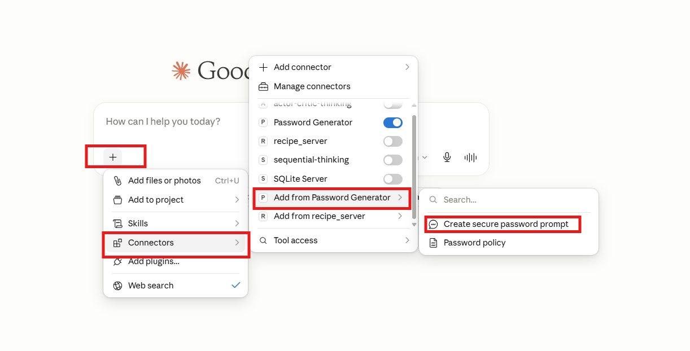
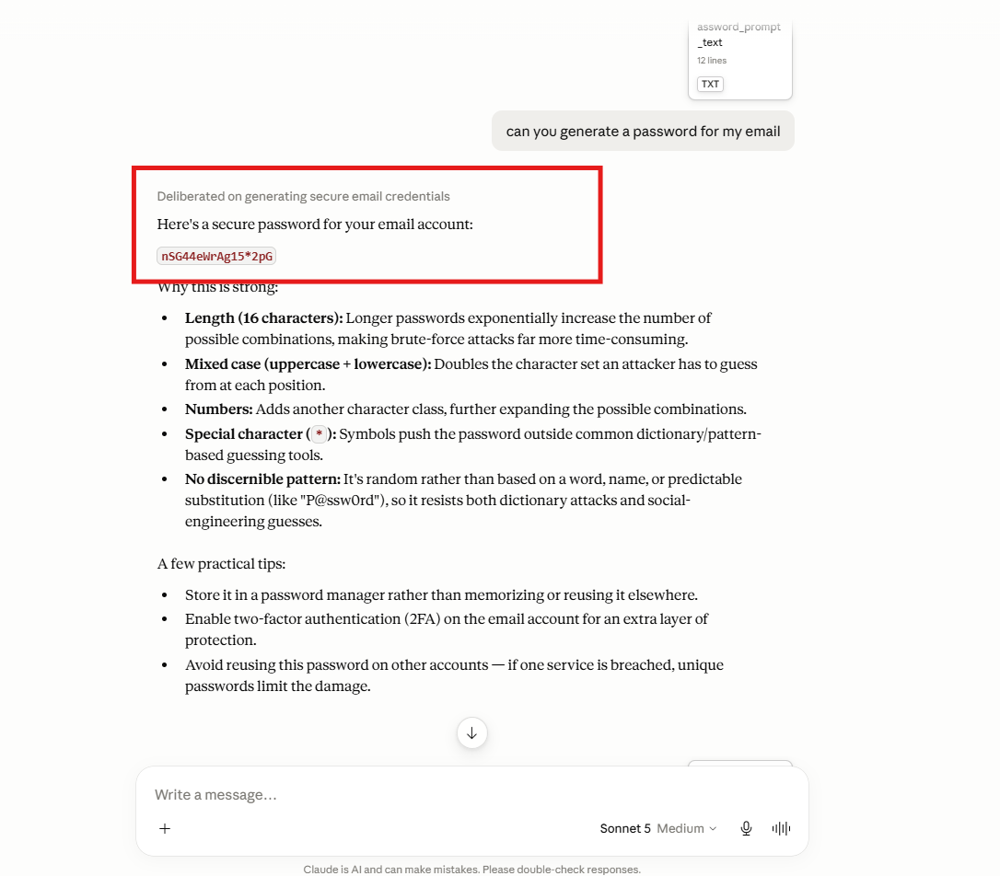

# Password Generator MCP Server

A simple **Model Context Protocol (MCP)** server built using the **Python MCP SDK** to demonstrate the three core **MCP Primitives**:

- 🛠️ **Tools** – Generate a secure password.
- 📄 **Resources** – Expose a password policy.
- 💡 **Prompts** – Provide a reusable prompt template for generating secure passwords.

This project accompanies my Medium article on **MCP Inspector** and **MCP Primitives**, providing a hands-on example to help you understand how these concepts work together.

---

# Project Structure

```text
MCP-INSPECTOR/
│
├── prompts/
│   ├── __init__.py
│   └── password_prompt.py
│
├── resources/
│   ├── __init__.py
│   └── password_resource.py
│
├── tools/
│   ├── __init__.py
│   └── password_tool.py
│
├── .gitignore
├── .python-version
├── app.py
├── pyproject.toml
├── README.md
├── server.py
└── uv.lock
```

### Project Overview

- **app.py** – Creates the FastMCP server instance.
- **server.py** – Entry point that registers all MCP primitives and starts the server.
- **tools/password_tool.py** – Implements the Password Generator Tool.
- **resources/password_resource.py** – Exposes the Password Policy Resource.
- **prompts/password_prompt.py** – Defines the reusable Prompt template.
- **pyproject.toml** – Project configuration and project dependencies.
- **uv.lock** – Lock file generated by UV.
- **README.md** – Project documentation.

---

# Clone the Repository

Clone the repository to your local machine.

```bash
git clone <YOUR_GITHUB_REPOSITORY_LINK>
```

Navigate to the project directory.

```bash
cd MCP-INSPECTOR
```

Synchronize and install all project dependencies.

```bash
uv sync
```

Activate the virtual environment.

**Windows**

```bash
.venv\Scripts\activate
```

---

# Running the MCP Server with MCP Inspector

Start the MCP server using:

```bash
mcp dev server.py
```

This command starts the MCP server and automatically launches **MCP Inspector** in your browser.

Using MCP Inspector you can:

- View all registered MCP primitives.
- Execute Tools.
- Read Resources.
- Test Prompt templates.
- Validate your MCP server before integrating it with an MCP client.

**Screenshot:** *MCP Inspector Home Page*

---

# Testing the Tool

Open the **Tools** section inside MCP Inspector.

Select **generate_password** and provide the required inputs such as:

- Password Length
- Include Special Characters

Execute the Tool to generate a secure password.

**Screenshot:** *Password Generator Tool*

**Screenshot:** *Generated Password Output*

---

# Testing the Resource

Open the **Resources** section.

Select the **password://policy** resource.

The server returns the password policy and security recommendations exposed by the MCP server.

**Screenshot:** *Password Policy Resource*

---

# Testing the Prompt

Navigate to the **Prompts** section.

Select **create_secure_password_prompt**.

Provide an account type such as:

- Banking
- Email
- Social Media

The Prompt generates a reusable instruction template for creating a secure password.

**Screenshot:** *Prompt Execution*

---

# Installing the MCP Server in Claude Desktop

Open a **new terminal** and run:

```bash
mcp install server.py
```

Once the installation is complete, restart **Claude Desktop** if it is already running.

Claude Desktop will automatically discover the MCP server and its registered primitives.

You can now interact with the server using natural language.

For example:

> Generate a strong password for my email.

or

> Show me the password policy.


*Claude Desktop Detecting the MCP Server*


*Claude Desktop Invoking the Password Generator Tool*

---

# Creating an MCP Project from Scratch

If you'd like to build your own MCP server from scratch, follow these steps.

### 1. Initialize a UV Project

```bash
uv init
```

---

### 2. Create a Virtual Environment

```bash
uv venv
```

---

### 3. Activate the Virtual Environment

**Windows**

```bash
.venv\Scripts\activate
```

---

### 4. Install the MCP SDK

```bash
uv add "mcp[cli]"
```

---

### 5. Start MCP Inspector

```bash
mcp dev server.py
```

---

### 6. Install the MCP Server in Claude Desktop

Open a new terminal and run:

```bash
mcp install server.py
```

---

# MCP Primitives Included

### 🛠️ Tool

**generate_password()**

Generates a secure password with configurable length and optional special characters.

---

### 📄 Resource

**password://policy**

Returns the password generation policy and recommended password security practices.

---

### 💡 Prompt

**create_secure_password_prompt()**

Creates a reusable prompt template for generating a secure password for a specified account type.

---

# Medium Article

If you're new to MCP and would like a detailed explanation of **MCP Inspector** and **MCP Primitives**, check out my accompanying Medium article.

**Medium:** <YOUR_MEDIUM_ARTICLE_LINK>

---

